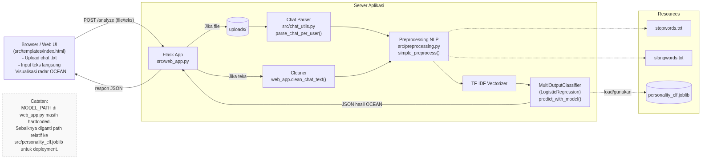
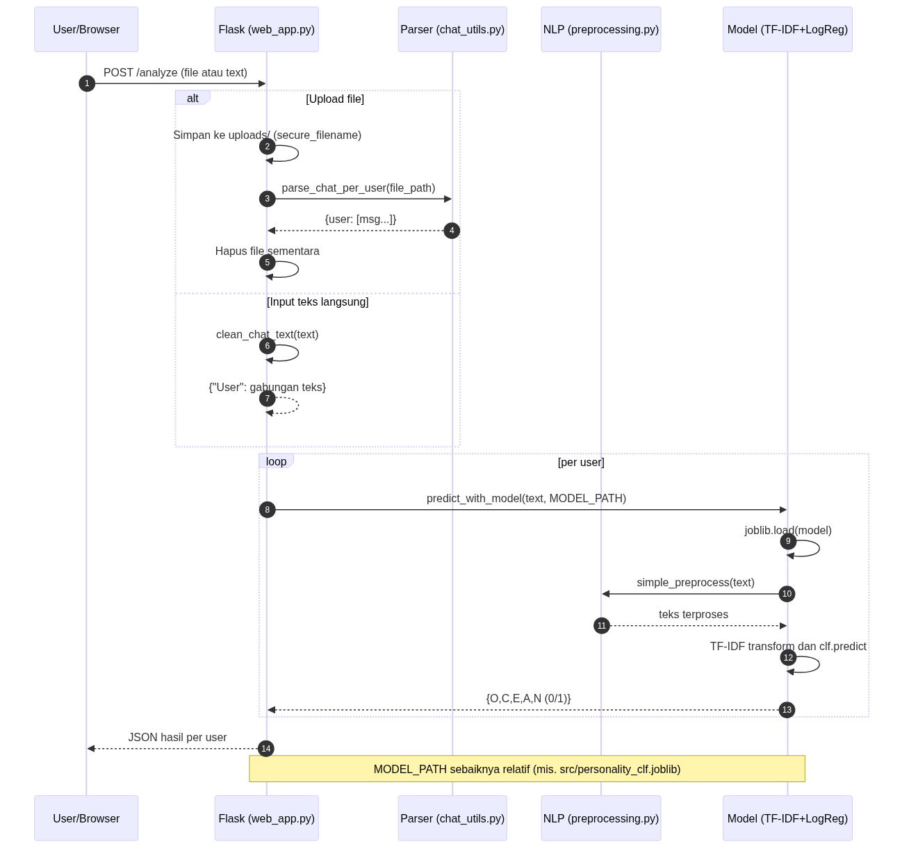

# Arsitektur Sistem AI Personality Detector

Dokumen ini menjelaskan arsitektur sistem **AI Personality Detector**, sebuah aplikasi web berbasis Flask yang menganalisis pola komunikasi percakapan untuk mendeteksi kepribadian pengguna berdasarkan model OCEAN (Openness, Conscientiousness, Extraversion, Agreeableness, Neuroticism).

## Diagram Arsitektur Tingkat Tinggi



Diagram di atas menunjukkan komponen utama sistem dan bagaimana mereka berinteraksi:

### Komponen Utama

1. **Browser / Web UI** (`src/templates/index.html`)
   - Antarmuka pengguna untuk upload file chat (.txt) atau input teks langsung
   - Menampilkan visualisasi hasil analisis OCEAN dalam bentuk radar chart
   - Berkomunikasi dengan Flask backend melalui endpoint `/analyze`

2. **Flask Application** (`src/web_app.py`)
   - Web server utama yang menangani request HTTP
   - Endpoint `/` untuk menampilkan halaman utama
   - Endpoint `/analyze` untuk memproses chat dan mengembalikan prediksi OCEAN
   - Mengelola upload file ke direktori `uploads/`

3. **Chat Parser** (`src/chat_utils.py`)
   - Fungsi `parse_chat_per_user()` untuk memparse file chat WhatsApp
   - Mengekstrak pesan per pengguna dari format WhatsApp
   - Format yang didukung: `[tanggal, jam] Nama: Pesan`

4. **Text Cleaner** (`web_app.clean_chat_text()`)
   - Membersihkan teks dari timestamp dan nama pengirim
   - Digunakan untuk input teks langsung (non-file)

5. **Preprocessing NLP** (`src/preprocessing.py`)
   - Fungsi `simple_preprocess()` untuk preprocessing teks
   - Menghapus URL, mention, hashtag
   - Normalisasi kata slang menggunakan `slangwords.txt`
   - Filtering stopwords dasar menggunakan `stopwords.txt`
   - Tokenisasi dan pembersihan teks

6. **TF-IDF Vectorizer**
   - Mengonversi teks menjadi vektor fitur numerik
   - Konfigurasi: max_features=2000, ngram_range=(1,2)
   - Termasuk dalam model yang disimpan

7. **MultiOutputClassifier (Logistic Regression)**
   - Fungsi `predict_with_model()` di `src/model.py`
   - Memprediksi 5 trait OCEAN secara simultan
   - Menggunakan Logistic Regression dengan class_weight='balanced'
   - Model disimpan dalam `src/personality_clf.joblib`

### Resources

- **stopwords.txt**: Daftar kata-kata umum yang akan difilter
- **slangwords.txt**: Pemetaan kata slang ke kata formal (format: `slang:formal`)
- **personality_clf.joblib**: Model machine learning terlatih (TF-IDF + Classifier)

## Diagram Sequence Endpoint `/analyze`



Diagram sequence di atas menunjukkan alur detail dari endpoint `/analyze`:

### Alur Proses

#### Upload File
1. User mengirim request POST ke `/analyze` dengan file chat
2. Flask menyimpan file ke `uploads/` dengan `secure_filename`
3. Parser (`parse_chat_per_user`) memparse file menjadi dictionary `{user: [messages]}`
4. File sementara dihapus setelah parsing

#### Input Teks Langsung
1. User mengirim request POST ke `/analyze` dengan field `text`
2. Flask memanggil `clean_chat_text()` untuk membersihkan format chat dari timestamp dan nama pengirim
3. Hasil berupa teks yang sudah dibersihkan, kemudian dibungkus dalam dictionary `{"User": cleaned_text}`

#### Prediksi per User
Untuk setiap user dalam hasil parsing/cleaning:
1. Flask memanggil `predict_with_model(text, MODEL_PATH)`
2. Model dimuat dari file joblib
3. Teks diproses dengan `simple_preprocess(text)`
4. Teks di-transform dengan TF-IDF
5. Classifier memprediksi 5 trait OCEAN (nilai 0 atau 1)
6. Hasil dikembalikan sebagai dictionary `{O, C, E, A, N}`

#### Response
Flask mengembalikan JSON dengan struktur:
```json
{
  "success": true,
  "results": {
    "User1": {"openness": 1, "conscientiousness": 0, "extraversion": 1, "agreeableness": 1, "neuroticism": 0},
    "User2": {...}
  }
}
```

## Catatan Teknis

### Path Model (Hardcoded)

⚠️ **Perhatian**: Saat ini `MODEL_PATH` di `src/web_app.py` masih menggunakan absolute path yang hardcoded:

```python
MODEL_PATH = r'E:\muhar\Tugas Matkul\S5\KECERDASAN BUATAN\ai_personality_detector\src\personality_clf.joblib'
```

**Rekomendasi untuk deployment**: Gunakan path relatif agar lebih portable:

```python
import os
MODEL_PATH = os.path.join(os.path.dirname(__file__), 'personality_clf.joblib')
```

Atau:
```python
MODEL_PATH = 'src/personality_clf.joblib'
```

### Model Machine Learning

**Algoritma**: Multi-output Logistic Regression
- **Preprocessing**: TF-IDF Vectorization
- **Features**: max_features=2000, ngram_range=(1,2)
- **Classifier**: LogisticRegression dengan solver='liblinear', class_weight='balanced'
- **Output**: 5 binary labels (0/1) untuk setiap trait OCEAN

**Training**: Model dilatih menggunakan script di `src/model.py` dengan function `train_classifier()`.

### Trait OCEAN

1. **Openness (O)**: Keterbukaan terhadap pengalaman baru, kreativitas
2. **Conscientiousness (C)**: Disiplin, ketelitian, tanggung jawab
3. **Extraversion (E)**: Sosialisasi, semangat, suka berbicara
4. **Agreeableness (A)**: Keramahan, empati, kerja sama
5. **Neuroticism (N)**: Kecemasan, emosi negatif

## Struktur Direktori Proyek

```
ai_personality_detector/
├── diagrams/                    # Diagram arsitektur sistem
│   ├── architecture.mmd         # Source Mermaid arsitektur
│   ├── architecture.png         # Diagram arsitektur (PNG)
│   ├── architecture.jpg         # Diagram arsitektur (JPG)
│   ├── analyze-sequence.mmd     # Source Mermaid sequence
│   ├── analyze-sequence.png     # Diagram sequence (PNG)
│   └── analyze-sequence.jpg     # Diagram sequence (JPG)
├── docs/
│   └── ARCHITECTURE.md          # Dokumentasi arsitektur (file ini)
├── src/
│   ├── web_app.py               # Flask application
│   ├── model.py                 # ML model training & prediction
│   ├── preprocessing.py         # Text preprocessing
│   ├── chat_utils.py            # Chat parsing utilities
│   ├── personality_clf.joblib   # Trained model
│   └── templates/
│       └── index.html           # Web UI
├── data/
│   └── chat_sample_labeled.txt  # Sample chat data
├── stopwords.txt                # Stopwords list
├── slangwords.txt               # Slang normalization
└── uploads/                     # Temporary upload directory
```

## Menjalankan Aplikasi

### Prerequisites
```bash
pip install -r requirements.txt
```

### Menjalankan Web Server
```bash
python src/web_app.py
```

Aplikasi akan berjalan di `http://localhost:5000`

### Melatih Model Baru
```bash
python src/model.py
```

**Catatan**: Untuk melatih model, diperlukan file dataset `data/train.csv` dengan format:
```
id,text,openness,conscientiousness,extraversion,agreeableness,neuroticism
1,"contoh teks",1,0,1,1,0
...
```

Model akan disimpan sebagai `personality_clf.joblib`

## Pengembangan Lebih Lanjut

1. **Perbaikan Path Model**: Ubah hardcoded path menjadi path relatif untuk portabilitas
2. **Environment Configuration**: Gunakan environment variables atau config file untuk path dan settings
3. **Validasi Input**: Tambahkan validasi lebih ketat untuk input file dan teks
4. **Error Handling**: Perbaiki handling error yang lebih informatif
5. **Model Enhancement**: Latih model dengan dataset yang lebih besar untuk akurasi lebih baik
6. **Testing**: Tambahkan unit tests dan integration tests
7. **Docker**: Containerize aplikasi untuk deployment yang lebih mudah

## Referensi

- **Flask**: https://flask.palletsprojects.com/
- **scikit-learn**: https://scikit-learn.org/
- **Sastrawi (Indonesian Stemmer)**: https://github.com/sastrawi/sastrawi
- **Model OCEAN**: Big Five personality traits
